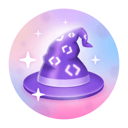
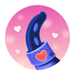

# GitHub Achievements Guide

Welcome to the **GitHub Achievements Guide**! 🎉 This repository is dedicated to showcasing all the achievements you can unlock on GitHub, along with tips on how to earn them.

## 🚀 What Are GitHub Achievements?
GitHub provides a set of achievements (also known as badges) to recognize user contributions, activity, and engagement on the platform. These badges appear on your GitHub profile and can be a great way to showcase your involvement in the community.

## 🏆 List of Achievements

Here is a list of known GitHub achievements:

| Achievement | Badge | Description | How to Earn It |
|-------------|-------|-------------|----------------|
| **Starstruck** |  | Given to users who receive stars on their repositories | Get stars on one or more repositories |
| **Galaxy Brain** |  | Awarded for contributing valuable discussions in GitHub Issues or Discussions | Provide accepted answers and engage in discussions |
| **Pull Shark** |  | Given to users who make successful pull requests | Merge pull requests into repositories |
| **YOLO** |  | Awarded for making a bold pull request without testing or reviewing it first. | Submit a significant pull request without testing or reviewing it, and have it accepted |
| **Pair Extraordinaire** |  | Recognizes pair programming activities | Co-author commits with others |
| **Public Sponsor** |  | Awarded to users who sponsor developers on GitHub | Sponsor at least one developer via GitHub Sponsors |
| **Open Sourcerer** |  | Awarded for making significant contributions to open-source projects | 
?
 |
| **Heart On Your Sleeve** |  | Given to users who react frequently to discussions and issues | 
?
 |

## 📖 How to Contribute
We encourage contributions! If you discover a new achievement or have insights on how to unlock them, feel free to:

- Add or update information 📝
- Submit a pull request 🚀

## 🔗 Useful Resources
- [GitHub Docs: Achievements](https://docs.github.com/)
- [Official GitHub Blog](https://github.blog/)

Let's unlock all the achievements together! 🎉

